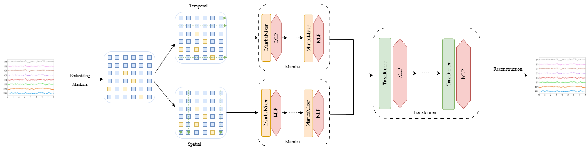

<div align="center">

# 🧠 BraMT

**Brain Mamba & Transformer**

</div>

BraMT 是一个 EEG 基座模型，面向 EEG 预训练与下游解码任务。通过融合 Mamba 的长序列建模能力和 Transformer 的全局交互能力，结合创新的 Criss-Cross Sequence 设计，实现更高效的 EEG 基座模型。

本仓库目前维护两个分支：

- `main`：GPU 版本。
- `npu`：华为云 NPU 版本。

## 🎓 项目背景

本项目属于浙江大学本科生科研训练（SRTP）项目，基于 [CBraMod](https://github.com/wjq-learning/CBraMod) 框架开发。

我们在 CBraMod 的 Criss-Cross Transformer 架构基础上进行创新：
- **引入 Mamba 长序列建模能力**：利用选择性扫描机制处理超长 EEG 序列
- **Criss-Cross Sequence 设计**：针对 EEG 信号的多维特性（时间-通道-频率），提出交错序列处理方案，分别沿时间和通道维度进行 Mamba 处理，再通过全局融合门实现多尺度特征交互
- **混合 Mamba-Transformer 架构**：结合局部 Mamba 的高效性和全局 Attention 的表达力，为 EEG 基座模型的预训练与下游任务微调提供统一框架

**致谢**：感谢 [CBraMod](https://github.com/wjq-learning/CBraMod) 开源项目提供的宝贵参考与启发。


## 🏗️ 模型架构概览

<div align="center">



</div>

## 🔨 环境配置

### 1. 环境安装

安装 Python 依赖：

```bash
pip install -r requirements.txt
```

## 🚀 预训练

预训练入口为 `pretrain_main.py`。

我们已将预训练 checkpoint 上传到 **HuggingFace**。

> **HuggingFace 仓库**：[SpringRainawa/BraMT](https://huggingface.co/SpringRainawa/BraMT)

## ⛵ 下游微调

下游微调入口为 `finetune_main.py`。

## 📊 实验结果

所有结果都来自 **每个数据集单独调参优化** 后的实验。

### 1. 下游性能对比

#### SHU-MI (运动想象)

| 指标 | BraMT | CBraMod |
| --- | --- | --- |
| Acc | **0.6449 ± 0.0052** | 0.6370 ± 0.0151 |
| PR-AUC | 0.6990 ± 0.0108 | **0.7139 ± 0.0088** |
| ROC-AUC | **0.7057 ± 0.0065** | 0.6988 ± 0.0068 |

#### FACED (情绪识别)

| 指标 | BraMT | CBraMod |
| --- | --- | --- |
| Acc | **0.5567 ± 0.0052** | 0.5509 ± 0.0089 |
| Kappa | 0.4991 ± 0.0056 | **0.5041 ± 0.0122** |
| F1 | 0.5571 ± 0.0048 | **0.5618 ± 0.0093** |

#### BCIC (EEG 解码)

| 指标 | BraMT | CBraMod |
| --- | --- | --- |
| Acc | **0.5533 ± 0.0094** | 0.5373 ± 0.0108 |
| Kappa | **0.4417 ± 0.0118** | 0.4216 ± 0.0163 |
| F1 | **0.5533 ± 0.0095** | 0.5383 ± 0.0096 |

#### PhysioNet (运动想象)

| 指标 | BraMT | CBraMod |
| --- | --- | --- |
| Acc | 0.6012（单次） | **0.6417 ± 0.0091** |
| Kappa | 0.4682（单次） | **0.5222 ± 0.0169** |
| F1 | 0.6054（单次） | **0.6427 ± 0.0100** |


总体而言，BraMT 已经在多个 EEG 任务上具备较强竞争力，尤其适合长序列和结构复杂场景。

